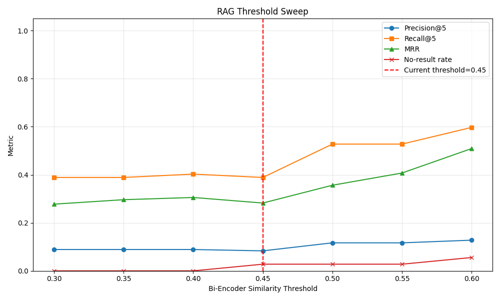
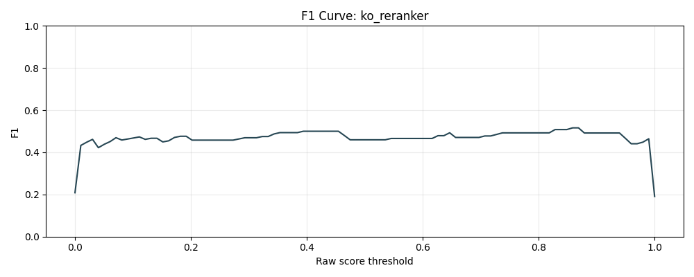
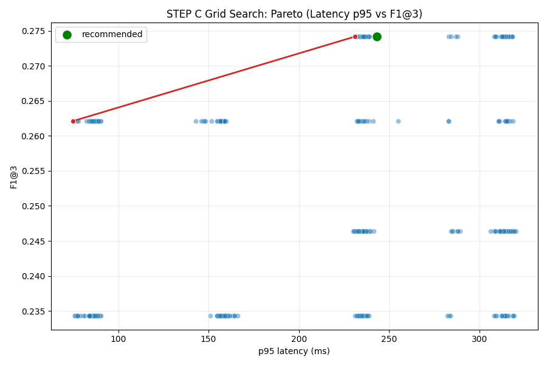

# YGSS RAG 시스템 리팩토링

> **작업 기간:** 2026.04.26 ~ 2026.05.04  
> **브랜치:** `refactor` (master 미반영)
> **작업자:** jinnyujinchoi

---

## 목차

1. [As-Is: 발견된 문제](#as-is-발견된-문제)
2. [To-Be: 개선 내용](#to-be-개선-내용)
3. [작업 흐름](#작업-흐름)
4. [측정 결과](#측정-결과)
5. [디렉토리 구조](#디렉토리-구조)
6. [실행 방법](#실행-방법)

---

## As-Is: 발견된 문제

코드 리뷰를 통해 발견한 문제를 심각도 순서로 정리.

### 1. RAG 평가 품질

**문제 1: 한국어 Q&A를 영어 Cross-Encoder로 평가**

```python
# ai/src/api/routes/server.py (변경 전)
model = CrossEncoder("cross-encoder/ms-marco-MiniLM-L-12-v2")
```

`ms-marco-MiniLM-L-12-v2`는 영어 MS MARCO 데이터셋으로 학습된 영어 전용 모델로, 
위 모델로 한국어 Q&A 쌍 평가는 무의미하다고 판단.

**문제 2: 근거 없는 매직 넘버 4개**

| 위치 | 코드 | 문제 |
|---|---|---|
| `VectorRepository.java:84` | `if(sim < 0.45) continue;` | 0.45에 대한 근거 없음 |
| `ChatBotServiceImpl.java:33` | `searchAllPrefixes(..., 10)` | 10에 대한 근거 없음 |
| `server.py` | `score >= 6` | 영어 모델 기준 매직 넘버, 한국어 모델에 무의미 |
| `server.py` | `filtered[:3]` | 3에 대한 근거 없음 |

**문제 3: 평가 도구 부재**

모델 및 변인 측정 방법 부재.  
측정 없이 운영 코드를 수정은 무의미한 작업이라 판단.

## To-Be: 개선 내용

### ✅ 개선 1: 독립적인 RAG 평가 프레임워크 구축

**운영 코드를 건드리지 않고** Python으로 동일한 retrieval 파이프라인을 재현하여 측정.

- eval_set 36개 (chat_dummy 기반, 정의형/계산형/비교형/맥락형)
- 임베딩: OpenAI `text-embedding-3-small` (운영 동일)
- 지표: Precision@K, Recall@K, F1, MRR, no-result rate, latency
- preflight 게이트: 측정 전 5개 환경 조건 검증, 미통과 시 측정 중단

### ✅ 개선 2: Cross-Encoder 한국어 모델 교체

한국어 모델 후보 4종을 eval_set으로 비교 측정해 데이터 기반으로 선정.

| 모델 | Top-3 정확도 | MRR | p95 latency |
|---|---:|---:|---:|
| ms-marco-MiniLM-L-12-v2 (영어, 기존) | 41.67% | 0.282 | 41ms |
| dragonkue/bge-reranker-v2-m3-ko | 83.33% | 0.653 | 161ms |
| **Dongjin-kr/ko-reranker** ⭐ | **91.67%** | **0.745** | **164ms** |
| BAAI/bge-reranker-v2-m3 | 83.33% | 0.685 | 160ms |

**선정: `Dongjin-kr/ko-reranker`** — Top-3 정확도 기존 대비 +50%p

### ✅ 개선 3: 4-parameter Grid Search (420 조합)

4개 파라미터를 체계적으로 탐색해 각 파라미터의 실제 영향을 수치로 확인.

| 파라미터 | 탐색 공간 | 민감도 결과 | 결론 |
|---|---|---|---|
| `bi_threshold` | 0.30~0.60 (7개) | **평평** — 변화 없음 | 0.45 현행 유지 |
| `bi_top_k` | 5, 10, 15, 20 | 10→15 미미한 상승 | 10 현행 유지 |
| `cross_threshold` | 0.41~0.61 (5개) | **가장 민감** — 0.46 초과 시 급하락 | **6.0 → 0.41 변경** |
| `cross_top_n` | 1, 3, 5 | 평평 | 3 현행 유지 |

**핵심 발견 사항:** 4개 중 `cross_threshold`만 의미 있는 파라미터로 판단,
나머지 3개는 현행 유지.(grid-search 기반)

---

## 작업 흐름

```
브랜치 구조
──────────────────────────────────────────────
master
└── refactor
      ├── rag-eval-framework     STEP A: 평가 프레임워크 구축
      ├── ko-cross-encoder       STEP B: 한국어 모델 비교 초안
      ├── rag-eval-hardening     v2: fallback 제거 + preflight 게이트
      │                          v3: Colab 환경 이전 + 실측정
      └── rag-grid-search        STEP C: grid search + 결과 정제
```

### 주요 트러블슈팅

**v1 (4.26)** — STEP A~C 지시서 작성, Codex가 평가 프레임워크와 모델 비교 코드 구현

**QA 피드백 (4.29)** — 치명적 결함 2개 발견
- embedder가 `local-hash` fallback으로 동작 → 측정값 전부 무효
- 한국어 모델 2종 로드 실패 → 비교 대상이 영어 모델 2개뿐
- 19.44%라는 수치를 측정값으로 사용하고 "운영 후보 선정"이라는 결론을 냈던 것이 QA에서 미통과

**v2 (4.29)** — 코드 하드닝
- `local-hash`, `LexicalFallbackScorer` 클래스 삭제 (fallback 경로 자체 제거)
- `preflight.py` 신설 — 5개 항목 검증 후에만 측정 진입
- 한국어 모델 4종으로 확장, 다중 로드 전략 도입

**v3 (5.02)** — 로컬 환경 제약 → Colab으로 이전
- 로컬 디스크 부족(1.1GiB), OpenAI quota 소진, HF 모델 로드 실패
- `runner.py`가 `source_mode=sql_dump`일 때 Redis 없이 동작하는 것을 확인
- Colab T4 GPU에서 4모델 비교 완료 → ko_reranker 선정

**v4 (5.04)** — STEP C grid search
- 420 조합 실행 완료
- 민감도 분석으로 `cross_threshold`만 유의미한 파라미터임을 확인
- results/ 디렉토리 정제 (52개 → 17개 파일)

---

## 측정 결과

### STEP A: Bi-Encoder 임계값 스윕



**관찰:** 임계값 0.45 → 0.60으로 올릴수록 Recall, MRR이 상승.
현재 0.45는 너무 낮아 관련 없는 후보까지 Cross-Encoder로 넘기고 있음을 발견,
그러나 grid search 결과 단독으로 bi_threshold를 바꿔도 F1 변화가 없어 현행 유지를 결정.

### STEP B: Cross-Encoder 모델 비교



**관찰:** ko_reranker의 best F1 cutoff는 0.516이었으나,  
grid search에서 cross_threshold 민감도 분석 결과 0.41~0.46이 실제 최적 구간으로 확인.

### STEP C: Grid Search



**Pareto front:** latency 246ms 이내에서 F1@3 최대값은 0.274

**민감도 분석 요약:**

| 파라미터 | 그래프 형태 | 해석 |
|---|---|---|
| bi_threshold | 완전히 평평 | robust — 어느 값이든 무관 |
| bi_top_k | 10→15 계단 상승 후 평평 | 15 이상이면 충분, 단 no_result_rate 부작용 |
| cross_threshold | **0.46 기점으로 급하락** | sensitive — 0.41~0.46 구간 유지 필수 |
| cross_top_n | 완만 상승 후 3에서 수렴 | 3이면 충분 |

---

## 디렉토리 구조

```
ai/experiments/rag_eval/
├── src/                        핵심 모듈
│   ├── embedder.py             OpenAI 임베딩 래퍼 (fallback 없음)
│   ├── redis_search.py         Bi-Encoder retrieval (sql_dump / redis 양 모드)
│   ├── cross_encoder.py        Cross-Encoder 로더 (다중 전략)
│   ├── metrics.py              Precision, Recall, MRR, no-result rate
│   ├── preflight.py            측정 전 환경 검증 게이트
│   └── runner.py               baseline threshold sweep 실행
│
├── experiments/                STEP C 스크립트
│   ├── cross_encoder_comparison.py  모델 4종 비교
│   ├── grid_search.py          420 조합 탐색
│   ├── select_best_combination.py   최적 조합 선정
│   ├── sensitivity_analysis.py      파라미터별 민감도
│   ├── pareto_plot.py          Pareto front 시각화
│   └── decide_winner.py        모델 교체 vs 현행 유지 자동 판정
│
├── dataset/
│   └── eval_set.json           평가 셋 36개
│
├── tests/
│   ├── test_model_loading.py   4개 모델 로드 검증
│   └── test_no_regression.py   회귀 가드
│
├── results/                    측정 결과 (유효 파일만)
│   ├── baseline_threshold_sweep_20260502_112611.*  STEP A
│   ├── cross_encoder_comparison_20260502_113638.*  STEP B
│   ├── f1_curve_*_20260502_*                       STEP B 모델별 F1 곡선
│   ├── grid_search_20260504_054903.*               STEP C
│   ├── optimal_combination.*                        STEP C 최적 조합
│   ├── sensitivity_*.png                            STEP C 민감도
│   ├── grid_search_pareto.png                       STEP C Pareto
│   ├── _archive/               구버전 / 로그성 파일
│   └── _invalid/               무효 측정값 (local-hash 기반)
│
├── config.yaml                 실험 설정
├── requirements.txt            의존성
└── README.md                   이 문서
```

---

## 실행 방법

### 사전 준비

```bash
cd ai/experiments/rag_eval
python -m venv .venv
source .venv/bin/activate
pip install -r requirements.txt
```

`.env` 파일 생성 (`.env.example` 참고):

```env
OPENAI_API_KEY=sk-...
# GMS 프록시 사용 시에만 설정, Colab에서는 비워둘 것
OPENAI_BASE_URL=
```

### Colab 실행 (권장)

로컬 디스크가 부족하거나 HuggingFace 모델 로드가 필요한 경우 Colab T4 GPU 환경을 사용합니다.  
`source_mode=sql_dump` 설정 시 운영 Redis 없이 SQL 덤프만으로 전체 측정이 가능합니다.

```python
# Colab에서 config.yaml의 sql 경로를 절대경로로 수정 필요
cfg["data"]["chat_dummy_sql_path"] = "/content/ygss-rag-eval/exec/basic_insert.sql"
```

### STEP A: Baseline 측정

```bash
python -m src.runner
# 결과: results/baseline_threshold_sweep_{ts}.json, .png
```

### STEP B: Cross-Encoder 비교

```bash
python -m experiments.cross_encoder_comparison
# 결과: results/cross_encoder_comparison_{ts}.json, .md
```

### STEP C: Grid Search

```bash
python -m experiments.grid_search           # 420 조합 탐색 (~30분, Colab T4 기준)
python -m experiments.select_best_combination
python -m experiments.sensitivity_analysis
python -m experiments.pareto_plot
# 결과: results/grid_search_*.csv, optimal_combination.*, sensitivity_*.png, pareto.png
```

### 회귀 테스트

```bash
pytest tests/ -v
```

---

<!-- ## 후속 과제

이번 리팩토링 범위에 포함하지 않았으나 코드 리뷰에서 발견된 항목입니다.

| 항목 | 심각도 | 내용 |
|---|---|---|
| Jedis → JedisPool 전환 | 🔴 치명 | 동시 요청 thread-safety 확보 |
| Redis Vector Search (HNSW) 도입 | 🟡 경고 | 현재 O(N) 풀스캔 → 확장 가능 구조 |
| ChatBotServiceImpl try-catch 분해 | 🟡 경고 | 장애 원인 추적 가능성 확보 |
| 하드코딩 fallback 포트폴리오 제거 | 🟡 경고 | 장애 은폐 제거 |
| GPT/Gemini 죽은 코드 정리 | 🟢 낮음 | 유지보수성 개선 | -->


<!-- ## 포트폴리오 요약

> 운영 RAG 시스템의 retrieval 임계값이 근거 없이 설정되었음을 발견했고,
> 코드 리뷰 과정에서 한국어 Q&A를 영어 Cross-Encoder로 평가하던 더 큰 결함도 발견했습니다.
> 백엔드 서비스 영향을 차단하기 위해 별도의 Python 평가 프레임워크를 구축하고,
> fallback 경로를 제거한 preflight 게이트로 측정 신뢰성을 확보했습니다.
> Precision/Recall/MRR 기반으로 한국어 모델 후보 4종을 비교 측정해 최적 모델을 선정했고(Top-3 41% → 92%),
> 4개 파라미터에 대해 420 조합 grid search와 민감도 분석을 수행해
> cross_threshold만이 유의미한 파라미터임을 데이터로 확인했습니다. -->
